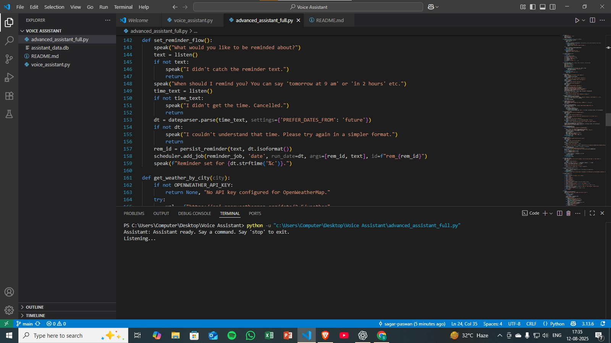

# Voice Assistant 🗣️💻


A Python-based voice assistant that can recognize speech, process commands, and respond with voice output.

## Features
- 🎤 Speech recognition
- 🔊 Voice output
- 🌐 Web search & browsing
- ⏰ Time and date announcements
- 📂 Open applications

## Requirements
```bash
pip install speechrecognition pyttsx3 wikipedia
